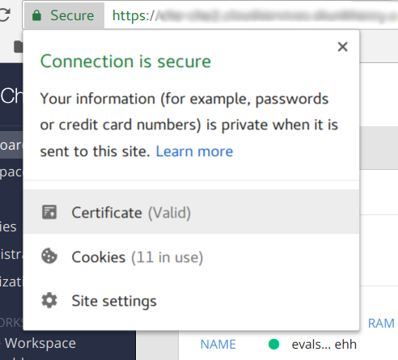
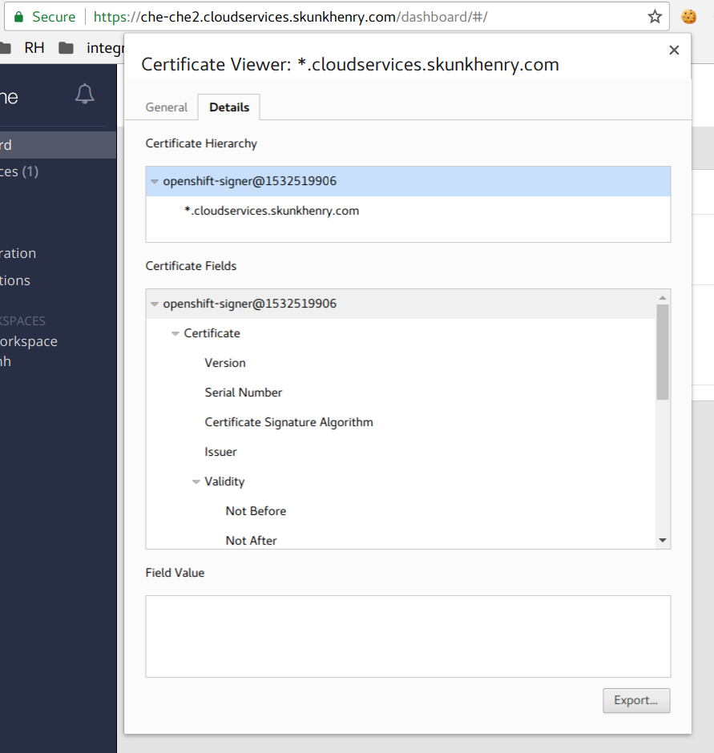
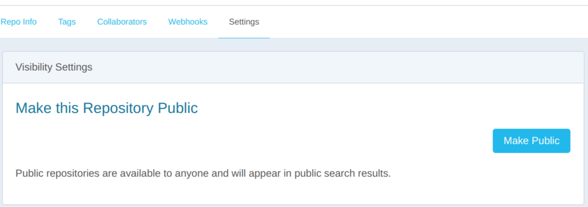
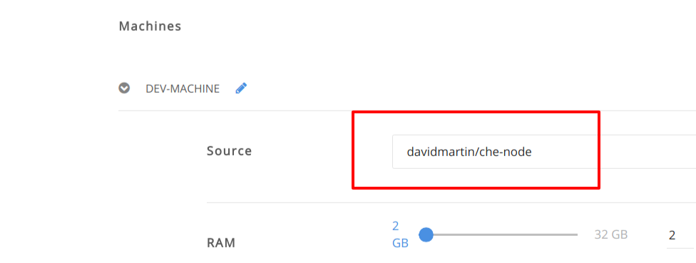

# Overview

This document will walk you through the following integration flow

- Creating a Enmasse message queue 
- Creating a connection and integration in fuse ignite linked to the Enmasse message queue
- Creating a http endpoint that can publish a message to the Enmasse queue 
- Creating a http endpoint that exposes a REST API using Launcher
- Creating a connection to REST API from fuse
- Creating an integration between all of these via Fuse Ignite


# Prerequisites 

The installation has already been performed on an OpenShift cluster as per the installation document https://github.com/integr8ly/installation/blob/master/README.md.


# Login and choose the evals namespace

Login to the OpenShift Web Console. You should login as the ```evals@example.com``` user. On the right hand side, you should see ```My Projects```. Select the ```evals``` project.
You should also take the opportunity to login the `oc` CLI as this user. You can do this by clicking the user at the top right of the OpenShift web console and selecting ```Copy Login Command``` from the drop down. Open a terminal and paste the command in.

# Setting up a Enmasse queue in your namespace 

- From your namespace click the catalog button on the left hand nav
- Provision a Enmasse service from the catalog (choose EnMasse standard) name it eval and choose not to bind at this time.
- Once complete, in the Eval namespace you will find a EnMasse provisioned service.
- Now create a binding to this provisioned service checking each available option. This will create a secret in the format `enmasse-standard-xxxxx-credentials-yyyyy`
- Collapse the provisioned service and click on the dashboard link which will show on the right hand side of the EnMasse provisioned service. This link will bring you to the EnMasse dashboard. 
- When asked to login click the OpenShift button and login with the same user that provisioned the service. In an eval environment this will be ```evals@example.com```
- Create a new address in the EnMasse console named ```work-queue/requests``` choose the ```queue``` option and the pooled plan.
- Create a second address in the EnMasse console named ```work-queue/worker-updates``` choose the ```queue``` option and the Pooled Queue.

# Deploy the CRUD REST HTTP booster

This is the HTTP endpoint that will revieve the requests from the Fuse Ignite 
integreation we create and add new fruits to the inventory.


Load up the launcher application. This is at ```http://launcher-launcher.<ROUTER_SUFFIX> ``` 

- Click on launch your project
- Login when prompted using the ```evals@example.com``` user
- The create application form will show. Choose ```eval``` as the name (this equates to your namespace)
- When prompted to select Target Environment choose : ```Code Locally, Build and Deploy```
- You will need to `Authorize` Launcher to create resources using your OpenShift account. This will refresh the wizard and prompt you to choose the Target Environment again.
- As Authorization is now done, you can click the blue down arrows
- Under mission select ```Crud```
- Under runtime select ```Spring Boot```
- Click the blue down arrows
- Under ``` Authorize Git Provider``` you will need to authorize launcher to have access to your github account.
- Once authorised, under the repository input change the value to ```crud-app```
- Wait for the down arrows to change color to blue, then click them
- Click setup application.
- This will create a repo called crud-app in your github account and deploy the CRUD booster to the `eval` namespace.

You can try out this application by going to the eval namespace and clicking on the route created for this new application.


# Deploy the Messaging booster

This is a webapp that connects to the EnMasse address space. It allows the user to add new fruit to the inventory of the CRUD app via the EnMasse and CRUD app Integration in Fuse.

- Following on from the previous application setup, click the `Start new project` button
- Choose ```eval``` as the application name again (This will deploy the Messaging booster to the same project as the CRUD booster)
- When prompted to select target environment choose : ```Code Locally, Build and Deploy```
- Click the blue down arrows
- Under mission select ```Messaging Work Queue```
- Under runtime select ```Node.js```
- Choose the ```integreatly``` option in the dropdown
- Click the down arrows
- Under the repository input change the value to ```messaging-frontend```
- Wait for the down arrows to change color to blue, then click them
- Click setup application.
- This will create a repo called messaging-frontend in your github account and deploy the Messaging booster to the `eval` namespace.

There are some credentials to set to allow the messaging frontend to connect to the EnMasse address space.
First, get the `username` and `password` values from the EnMasse binding secret.
It has a name in the format `enmasse-standard-xxxxx-credentials-yyyyy`

Edit the `messaging-service` configmap, setting the `MESSAGING_SERVICE_PASSWORD` & `MESSAGING_SERVICE_USER` to the values from the EnMasse binding secret.

```
oc edit cm messaging-service -n eval
```

Restart the booster services

```
oc rollout latest nodejs-messaging-work-queue-frontend -n eval
```

In the log of the application you should see something like:

```
frontend-nodejs-aad7: Connected to AMQP messaging service at messaging.enmasse-eval.svc:5672
```

# Setup Enmasse connection in Fuse Ignite

You will need the `username` and `password` credentials again for this section from the EnMasse binding secret (`enmasse-standard-xxxxx-credentials-yyyyy`)

- Open the Fuse Ignite console. You will find the route in the OpenShift Web Console overview screen for the `eval` project.
- Login in to the Fuse Ignite console using the evals@example.com user 
- Select `Connections` and `Create connection`
- Find the **AMQP Message Broker** connector and select it. (Be careful not to choose the **AMQ message broker** which has a similar name)
- Fill in the Connection URI Field with the following  ```amqp://messaging.enmasse-eval.svc:5672?amqp.saslMechanisms=PLAIN```
- Fill in the username and password fields with the `username` and `password` values from the EnMasse binding secret.
- Choose `Disable` for the Check Certificates dropdown
- Click Validate 
- Click the `Next` button at the top right
- Add a connection name ```enmasse```
- Click the `Create` button at the top right

# Setup HTTP connection to the CRUD REST booster in Fuse Ignite

- Stay in the Fuse Ignite console for this section
- Select `Connections` and `Create connection`
- Find the `HTTP Connector` and select it. 
- Set the base URL as the url exposed from the CRUD REST booster application that we created earlier (You can get this using `oc get route spring-boot-rest-http-crud -n eval`)
- Click `Validate` to ensure Fuse Ignite can reach the endpoint
- Click `Next` 
- Add a connection name ```crud booster```
- Click `Create`

# Creating the integration

- Stay in the Fuse Ignite console for this section
- Click on `Integrations` and `Create Integration`
- Click on the Enmaase connection
- Click on the ```Subscribe for messages``` option
- Under Destination Name add ```work-queue/requests ```
- Choose `Queue` as the Destination Type
- Click `Next`
- Set the `Select Type` as ```JSON Schema``` 
- Add the following schema to the `Definition`
```
{
	"$schema": "http://json-schema.org/draft-04/schema#",
	"type": "object",
	"properties": {
		"type": {
			"type": "string"
		},
		"stock": {
			"type": "string"
		}
	}
}
```
- Click `Done`
- On the ```Choose a Finish Connection``` screen select the `crud booster` connection you created
- Choose ```Invoke URL``` 
- In the URL Path set the path to ```/api/fruits```
- In the method select ```POST```
- Click `Next`
- Again under `Select Type` set it to ```JSON Schema``` 
- Add the following schema to the `Definition` field & click `Done`
```
{
	"$schema": "http://json-schema.org/draft-04/schema#",
	"type": "object",
	"properties": {
		"name": {
			"type": "string"
		},
		"stock": {
			"type": "string"
		}
	}
}
```

- Next click the small plus between the two connections on the left hand side then click ```Add a step```
- Click ```Data Mapper``` 
- Map the `stock` property in the Source to the `stock` property in the Target by dragging from one side to the other. If done correct, a blue line will link the Source & Target.
- Map `type` in the Source to `name` in the Target, again by dragging from one side to the other
- Click `Done` at the top right

## Add some Integration logging steps (optional)

To add some more visibility we can add some logging steps to our integration.

- On the left hand side inbetween the connections you will see small blue boxes with plus symbols. For each of these do the following:

- click the blue plus symbol
- click `Add a step`
- choose `Log`
- select ```Message Body```

Once done we should now have 3 steps (5 if you added logging) in our integration. Click `Publish` in the top right.

Name the integration ```steel thread``` and click `Publish` again.


# Edit the messaging booster in Che (optional)

If you want to modify any code from the boosters, you'll need to do some setup in Che first.
The Che Dashboard can be found at ```https://che-che.<ROUTER_SUFFIX>``` 

## Self Signed Certs setup

If using a self signed (non CA) certificate on the Che route, there are a couple of things that need to be done before a Workspace can be created and used.

* Create a custom Node.js stack with the self signed certificate included. This is required so that stack instances (workspaces) can make requests back to the Che server.
* Import the self signed certificate into your browser. This is required so that a websocket connection back to the Che Server can be established, which is required by many parts of the Che Browser IDE.

For both these tasks you will need the server certificate.
This has to be the certificate that the *OpenShift router* uses since OpenShift Web Console may use a different cert or domain. You can either retrieve the cert from the Openshift master node or export the cert from Chrome when you visit the Che Dashboard.

### Retrieve Certificate from Master node

This option requires ssh access to a master node on the target Openshift cluster where Che is running.

The CA cert can be found under the following path:

``` shell
[root@master]# /etc/origin/master/ca.crt
```

Copy the contents of this file and save it locally under `ca.crt`.

### Export Certificate using Google Chrome





When exporting the certificate, save it as `ca.crt`.

### Create a custom Node.js stack

A Che Stack requires a container image.
We can build a container image for the Node.js stack, importing the `ca.crt` file.
To do this, first create a directory and copy the `ca.crt` file into it.

```
mkdir /tmp/custom_nodejs_stack
cd /tmp/custom_nodejs_stack
cp ~/Downloads/ca.crt ./
```

Create a new file called `Dockerfile` with the below contents

```
FROM eclipse/node
ADD ./ca.crt /usr/local/share/ca-certificates/ca.crt
RUN sudo chmod 664 /usr/local/share/ca-certificates/ca.crt
RUN sudo update-ca-certificates
RUN cd ${HOME} && echo yes | keytool -keystore minishift.jks -importcert -alias HOSTDOMAIN -file /usr/local/share/ca-certificates/ca.crt -storepass minishift
```

Build the container image

```
docker build -t che/node .
```

Next, you'll need to push the image to a public registry.
For this example, a personal account on Docker Hub is used.
Tag the image with the correct url for your personal Docker Hub account & push it.

```
docker tag che/node docker.io/<dockerhubusername>/che-node
docker push docker.io/<dockerhubusername>/che-node
```

**IMPORTANT:** You will need to make the `che-node` image repository **public** in your Docker Hub account. You can do this from the Docker Hub web console.



Back in the Che Dashboard, go to the Stacks menu & clone the Node stack


Modify the stack to set the Machine image to the public image repository name i.e. `docker.io/<dockerhubusername>/che-node`



This stack can then be used to create a Workspace later.

### Import the self signed certificate into your browser

Before you can use a Workspace from your browser, the self-signed certificate needs to be imported. This allows the secure websocket connection to be established when you are in the Che IDE.
To do this in Chrome, open `chrome://settings/certificates`, then `Authorities > Import`. Choose the ca.crt file and import it.
You can check if it was imported correctly and is the correct cert when using a Workspace later. There should be no red errors related to `wss://` connections.

## Customise the messaging booster

With the Che setup done, we can create a workspace and modify the booster code.
The modification will add information to messages as they get sent from the messaging booster. To do this we will need to change some of the code in the messaging booster. 

- Login to the Che Dashboard. The url is in the format ```https://che-che.<ROUTER_SUFFIX>``` 
- Create a new workspace and select the custom Node.js Stack from the list of stacks (the stack that has the custom image with self-signed cert included)
- Click Add or Import Project button
- Click the Github tab
- Select the messaging-frontend booster repo that was created by Launcher and click the Add button
- Click Create button at the bottom of the screen
- When prompted, click the Open In IDE button
- Open the file ```frontend/app.js``` and modify the `message` body to prepend some text to the `type` in the ```/api/send-request``` endpoint e.g.

```js
app.post("/api/send-request", (req, resp) => {
    let message = {
        // ...
        body: JSON.stringify({type: 'Dr. Evals ' + req.body.text, stock: req.body.stock})
    };

    // ...
});
```

- Save your changes
- Open the `Profile` dropdown menu in the dashboard and select `Preferences`
- Under the `Git` option, select `Committer` and specify a `name` and valid Git `email address` in their associated text fields
- Click the `Save` button and `Close`
- Open the `Git` menu and click `Commit...`
- Type in a commit message into the message window e.g. 'Prepend body type`
- Select the `Push commited changes to` option and ensure it is pointing to ```origin/master``` then click `Commit`
- A new build of the app will trigger automatically in OpenShift. Wait for the build & redeploy to complete before moving on

# Invoke the integration

- Open the front end messaging webapp URL i.e. `http://frontend-eval.<ROUTER_SUFFIX>`
- Enter a Fruit name and a stock amount, then click `Send Request`
- Back in the Fuse console, open the integration and open the activity tab
- Expand the log entry. You should see the different steps it went through while invoking the integration
- Next open the route to the CRUD rest app. You should see a new Fruit type has been added with a stock quantity
